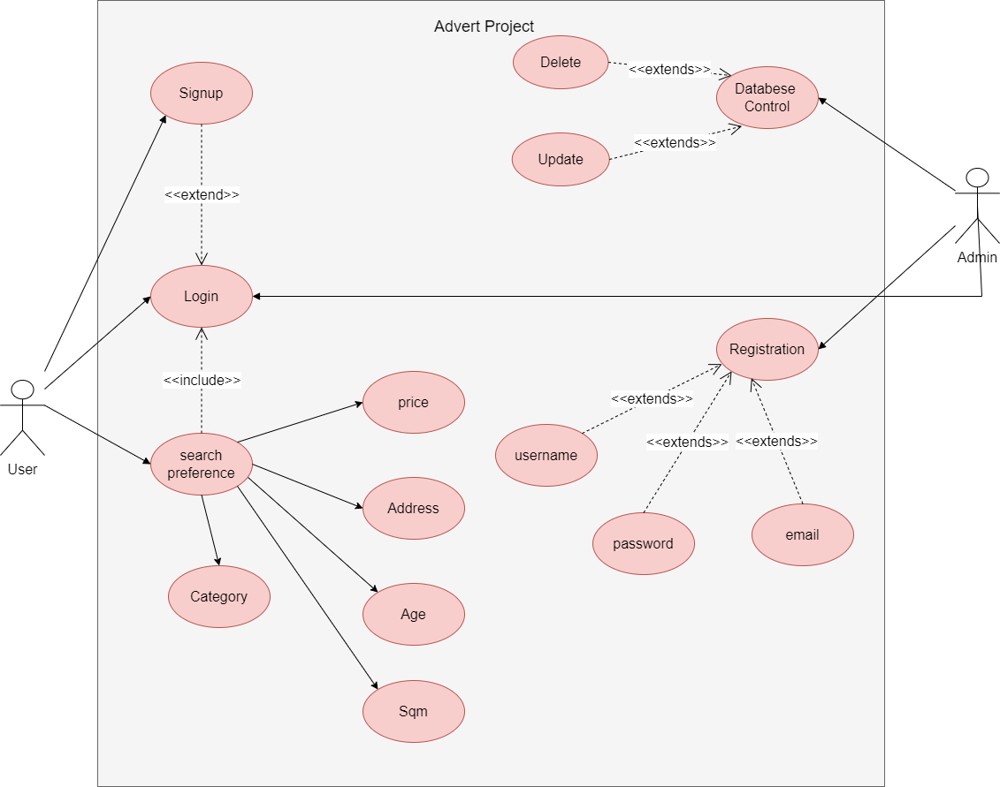

## Advert Site Project

### Requirements:

 ```sh
1. Category
2. Login (Authentication)
3. account creation
4. Scoring
5. Popular Searches
6. Compare
7. Purchasing
8. Comments
9. language option
   ```

### Analysis:
```sh
1. User can browse popular postings 
2. User can post an advert.
3. Admin does all user management.
4. Visitors can view adverts for rent or sale.
5. Admin can approve adverts.
```
### Design:
